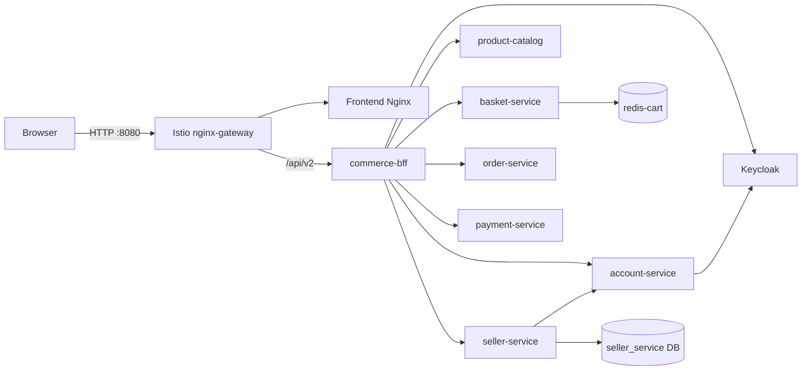

# ShopCart Marketplace MVP Runbook

## Scope

This runbook reproduces the marketplace MVP currently deployed to
`k3d-lab-k8s`. It preserves the existing orders, products, payment, RabbitMQ,
Redis and Keycloak data. It does not reset namespaces or PVCs.

Implemented in this phase:

- Vietnamese-first, mobile-first storefront, Buyer Center, Seller Center and
  Admin Console shells.
- Browser traffic enters through `/api/v2` on `commerce-bff`.
- Keycloak Authorization Code + PKCE login with server-side Redis sessions and
  `HttpOnly` cookies. Browser storage does not contain access tokens.
- Server-authoritative cart pricing and transitional bcrypt migration for old
  basket users.
- Catalog search, suggestions, filters and sorting.
- Account administration through the Keycloak Admin API.
- Persistent seller application and review workflow. Approval assigns the
  `seller-owner` role without replacing existing roles.
- Shared physical PostgreSQL runtime with separate databases/users prepared for
  seller, inventory and checkout services.
- Helm, External Secrets, Vault and Istio resources for all deployed services.

Phase 2-4 capabilities such as SPU/SKU migration, inventory reservation,
checkout saga, seller-order split, MinIO, Meilisearch, promotions, fulfillment,
returns, chat, analytics and real payment/shipping adapters remain disabled or
not implemented. Do not treat the current checkout as production-ready.

## Runtime Flow



## Prerequisites

```bash
k3d cluster list
kubectl --context k3d-lab-k8s cluster-info
helm version
docker version
```

Always pass `--context k3d-lab-k8s` to `kubectl` and
`--kube-context k3d-lab-k8s` to Helm. The default kube context may point to the
Rancher management cluster.

Secrets are stored only in Vault. Vault unseal/root material and the local
bootstrap admin password are stored in macOS Keychain. Never print these values
or put them in shell history.

## Backup Before Migration

The validated pre-migration backup is under the gitignored directory:

```text
config-secret-secure/.local/backups/marketplace-pre-migration-20260801_165446
```

Before another data migration, create a new timestamped directory with mode
`0700`, dump the products and orders databases in custom format, export
RabbitMQ definitions, and record SHA-256 checksums plus row counts. Validate
each dump with `pg_restore --list` before changing a workload or PVC. Follow the
database commands in `docs/helm-migration-runbook.md`.

## Build Local Images

Run from `/Users/phamquangtrung/biglab-k8s`:

```bash
docker build -t shopping-cart-frontend:v2.0.2-mvp1 shopping-cart-frontend
docker build -t shopping-cart-product-catalog:v1.2.0 shopping-cart-product-catalog
docker build -t shopping-cart-basket:v1.3.2 shopping-cart-basket
docker build -t shopping-cart-order:v1.0.3 shopping-cart-order
docker build -t commerce-bff:v0.1.3 commerce-bff
docker build -t account-service:v0.1.2 account-service
docker build -t seller-service:v0.1.1 seller-service

k3d image import shopping-cart-frontend:v2.0.2-mvp1 -c lab-k8s
k3d image import shopping-cart-product-catalog:v1.2.0 -c lab-k8s
k3d image import shopping-cart-basket:v1.3.2 -c lab-k8s
k3d image import shopping-cart-order:v1.0.3 -c lab-k8s
k3d image import commerce-bff:v0.1.3 -c lab-k8s
k3d image import account-service:v0.1.2 -c lab-k8s
k3d image import seller-service:v0.1.1 -c lab-k8s
```

Use a new immutable tag whenever code changes. Update the corresponding file in
`config-secret-secure/values/local/` before deployment.

## Install And Configure

Run these commands in order:

```bash
cd /Users/phamquangtrung/biglab-k8s/shopping-integration

./scripts/install-platform.sh
./scripts/bootstrap-vault.sh
./scripts/deploy-integration.sh
./scripts/configure-keycloak-marketplace.sh
./scripts/deploy-apps.sh
```

`bootstrap-vault.sh` is idempotent: it seeds a secret only when the Vault path
does not already exist. `configure-keycloak-marketplace.sh` is also idempotent
and never prints credentials.

Rotate the local marketplace admin password after accidental disclosure with:

```bash
./scripts/rotate-marketplace-admin-password.sh
```

The script updates macOS Keychain and Keycloak without printing the generated
password.

The Keycloak technical admin password is also stored in macOS Keychain under
service `shopping-cart-keycloak-admin` and account `k3d-lab-k8s` after running
`rotate-keycloak-admin-password.sh`.

The fixed realm roles are:

```text
platform-admin user-admin seller-reviewer catalog-moderator order-operator
finance-operator support-agent seller-owner seller-manager seller-staff buyer
```

The account service has only the Keycloak realm-management permissions needed
to view roles and manage users. Seller approval uses an internal bearer token
from `shopping-cart/shared/service-auth`; the same token is synchronized into
account-service and seller-service by External Secrets.

## Access

The k3d load balancer exposes the Istio gateway directly; no port-forward is
required:

- Storefront: `http://localhost:8080/`
- Storefront host route: `http://shopping-cart.localhost:8080/`
- Keycloak: `http://keycloak.localhost:8080/`
- Vault: `http://vault.localhost:8080/`

The `nginx-gateway` name is a Kubernetes Gateway API resource. Its data plane is
Istio Envoy; Nginx remains the frontend static-file server.

OIDC uses `shopping-cart.localhost` as its canonical cookie host. Starting login
from plain `localhost` automatically redirects to the canonical host before the
PKCE state cookies are created.

## Verification

```bash
cd /Users/phamquangtrung/biglab-k8s/shopping-integration
./scripts/verify-oidc-session.sh

kubectl --context k3d-lab-k8s get pods -A
kubectl --context k3d-lab-k8s get externalsecrets -A
helm list -A --kube-context k3d-lab-k8s

curl -fsS http://localhost:8080/ >/dev/null
curl -fsS 'http://localhost:8080/api/v2/products?search=phone&page_size=20' | jq .total
```

Expected state:

- Application pods are `2/2`; stateful data pods are Ready.
- Every ExternalSecret reports `SecretSynced=True`.
- OIDC, account API, OAuth basket, catalog search and seller approval pass.
- A fresh login after seller approval includes `seller-owner` without removing
  `buyer` or admin roles.

For every chart, also run `helm lint`, `helm template` and a server dry-run with
the global and service-specific values files before upgrade.

## Rollback

Application rollback is release-scoped and does not reset data:

```bash
helm history account-service -n shopping-cart-apps --kube-context k3d-lab-k8s
helm rollback account-service <REVISION> -n shopping-cart-apps --kube-context k3d-lab-k8s --wait

helm history seller-service -n shopping-cart-apps --kube-context k3d-lab-k8s
helm rollback seller-service <REVISION> -n shopping-cart-apps --kube-context k3d-lab-k8s --wait
```

Use the same pattern for `frontend`, `commerce-bff`, `basket-service` and
`product-catalog`. Roll back `shopping-integration` only when the failure is in
shared data or Gateway resources.

Do not delete a namespace or PVC during application rollback. Restore a
database only from a validated backup, into the matching logical database, and
compare row counts before reopening traffic. Vault and Keychain values are not
stored in this runbook.

## Next Safe Increment

The next deployment should add `inventory-service` and `checkout-service` as a
single vertical slice: migrate old quantity into inventory, reserve with row
locking and idempotency, calculate immutable totals server-side, create an
OrderGroup plus SellerOrders, then compensate reservations on payment failure.
Keep `/api/v1` compatibility until the generated `/api/v2` client covers that
flow and its Playwright tests pass.
