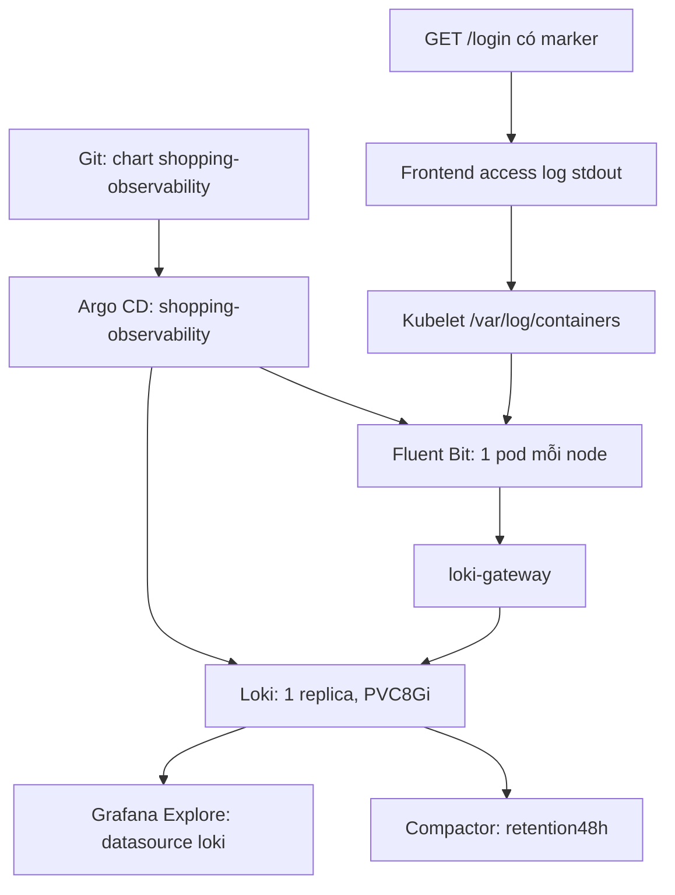

# PLAN_FLUENTBIT_LOKI — khôi phục logging Shopping Cart

Trạng thái cuối: HOÀN TẤT — các gate đạt; pipeline log thật và panel Grafana đã kiểm chứng.
Ngày: 2026-10-02. Context: k3d-lab-k8s.

## Mục tiêu và phạm vi

Bật lại Loki + Fluent Bit trong namespace `shopping-cart-observability`, qua chart
`shopping-observability/helmchart` và application Argo CD `shopping-observability` hiện có.
Grafana đang chạy nhận thêm datasource UID `loki`. Tạo request HTTP thật với marker
không nhạy cảm; tìm đúng access log chứa marker qua Loki và qua datasource Grafana.
Không tạo namespace/application/chart khác. Không tạo log giả hoặc push trực tiếp log thử vào Loki.

## Thiết kế trước triển khai

| Thành phần | Cấu hình dự kiến |
|---|---|
| Loki | SingleBinary, 1 replica, filesystem PVC 8Gi trên agent-1; giữ 48h; compactor xóa có delay 15m |
| Loki RAM/CPU | Request 256Mi/100m, limit 768Mi/500m; điều chỉnh nếu bằng chứng runtime cần |
| Gateway | 1 replica, request 16Mi/10m, limit 64Mi/100m |
| Fluent Bit | DaemonSet 3 node; request mỗi pod 32Mi/25m, limit 128Mi/200m |
| Log scope | `/var/log/containers/*_shopping-cart-*.log`, loại `shopping-cart-observability`; không thu mọi namespace |
| Offset/buffer | HostPath riêng `/var/lib/fluent-bit-shopping`; DB SQLite; filesystem buffer tối đa 50M/output |
| Backfill | Read_from_Head Off: bắt đầu log mới; giữ offset để tiếp tục sau restart |
| Labels Loki | job, cluster, kubernetes_namespace_name, kubernetes_pod_name, kubernetes_container_name, kubernetes_host; marker/request ID nằm trong nội dung, không làm label |
| Grafana | Datasource Loki UID loki → http://loki-gateway.shopping-cart-observability.svc.cluster.local |

Loki PVC hiện chưa có; tạo mới storage-loki-0 là dự kiến, không coi là phục hồi log lịch sử đã mất.
PVC Grafana/Prometheus/Alertmanager hiện có giữ nguyên. Fluent Bit filesystem queue và kubelet rotation
có giới hạn; pipeline này không bảo đảm không mất log khi gián đoạn quá lâu hoặc node mất dữ liệu.

## Thực thi từng bước

Khai báo trong mỗi terminal:

```sh
TRACE=/Users/phamquangtrung/Documents/Agent_setup/System/tools/run_logged.sh
REPO=/Users/phamquangtrung/Documents/Agent_setup/Artifacts/shopping-cart-k8s-publish
OBS=/Users/phamquangtrung/Documents/Agent_setup/Artifacts/shopping-metrics-plan
```

### 1. Baseline và kiểm tra rủi ro

```sh
$TRACE git -C "$REPO" fetch origin dev
$TRACE git -C "$REPO" status --short
$TRACE kubectl --context k3d-lab-k8s -n shopping-cart-observability get pods,pvc
$TRACE kubectl --context k3d-lab-k8s top nodes
$TRACE sysctl vm.swapusage
```

Xác minh log frontend đang ghi access log; BFF chỉ thấy startup, không hứa có access log từng request backend.
Grafana có một restart trước lần này, last reason Error/exit137; events có health probe timeout/503,
chưa đủ bằng chứng kết luận OOM. Theo dõi restart count khi bật pipeline; không tự tăng RAM chỉ theo suy đoán.

### 2. Sửa chart hiện có

Bật `loki.enabled`/`fluent-bit.enabled`, vẫn tắt Grafana standalone. Sửa scope/DB/buffer/resources,
thêm datasource Loki vào Grafana của metrics. Bump chart 0.4.0. Render kiểm tra:
không đổi PVC metrics, Loki 1 replica, Fluent Bit không còn node selector chặn scheduling,
datasource prometheus hiện có vẫn giữ UID prometheus.

```sh
$TRACE helm lint "$REPO/shopping-observability/helmchart"
$TRACE helm template shopping-observability "$REPO/shopping-observability/helmchart" --namespace shopping-cart-observability
$TRACE git -C "$REPO" diff --check
# Commit/push đúng những file chart được sửa, không commit Secrets hay rendered manifests.
```

### 3. Sync đúng application Argo CD

Refresh/Diff rồi sync riêng shopping-observability, không prune, chạy hooks.
Operation dùng hai source revisions cùng commit đã push và syncOptions
ServerSideApply=true, ClientSideApplyMigration=false. Không sync root/services và không Helm install riêng.

```sh
$TRACE kubectl --context k3d-lab-k8s -n argocd annotate application shopping-observability argocd.argoproj.io/refresh=hard --overwrite
$TRACE python3 "$OBS/sync-existing-observability.py" "$REPO"
$TRACE kubectl --context k3d-lab-k8s -n shopping-cart-observability rollout status sts/loki --timeout=180s
$TRACE kubectl --context k3d-lab-k8s -n shopping-cart-observability rollout status ds/fluent-bit --timeout=180s
$TRACE kubectl --context k3d-lab-k8s -n shopping-cart-observability get pods,pvc
```

### 4. Kiểm tra ingest/query và datasource

```sh
$TRACE kubectl --context k3d-lab-k8s -n shopping-cart-observability port-forward svc/loki-gateway 3100:80
```

Terminal khác: kiểm tra Loki ready/query API; Grafana datasource health/proxy query bằng script
đọc password từ Secret trong bộ nhớ, không in credential. Nếu Grafana pod rollout làm forward 3000
mất kết nối, mở lại từ Service đúng namespace.

### 5. Request thật → log thật

Script tạo marker `obs-loki-<UTC>-<random>`, GET `/login?obs_probe=<marker>` qua gateway đang dùng.
Không gửi credentials, không lưu response body. Xác minh HTTP200, tìm marker trong frontend stdout,
sau đó poll Loki trong tối đa 120s. Lưu evidence đã lọc: marker, UTC, HTTP status, labels và duy nhất
dòng log marker. Chạy lại query qua Grafana datasource proxy để xác nhận đường dùng thực tế.

LogQL dự kiến:

```logql
{job="fluent-bit",kubernetes_namespace_name="shopping-cart-apps",kubernetes_container_name="frontend"} |= "<marker>"
```

Lệnh kiểm tra thực tế (forward3000/3100 và gateway18080 phải đang chạy):

```sh
$TRACE python3 "$OBS/verify-logging.py"
```

Script tạo request mới, đối chiếu stdout/Loki/Grafana và cập nhật logging-evidence.json;
không ghi password/response body. Nếu gateway18080 cần mở lại:

```sh
$TRACE kubectl --context k3d-lab-k8s -n shopping-cart-gateway port-forward svc/nginx-gateway-istio 18080:80
```

Nếu label khác: xem labels thực tế rồi cập nhật query/plan. Nếu Fluent Bit 400/429:
kiểm tra timestamp, limits, label cardinality; sửa Git và sync lại. Nếu không có log source:
chọn đúng endpoint đang ghi access log, không giả tạo log để đạt tiêu chí.

### 6. Acceptance và hoàn thiện

- Argo Synced/Healthy/Succeeded; Loki 1 ready, gateway 1 ready, Fluent Bit 3/3 ready.
- Loki PVC Bound; PVC metrics vẫn đúng PV gốc.
- Request HTTP200; marker tìm được trong log nguồn, Loki và Grafana proxy.
- Loki config retention48h/compactor enabled xác minh runtime; chưa thể chứng minh xóa sau48h ngay trong buổi này.
- Đo RAM/CPU tăng thêm, restart/error counters; Prometheus/Grafana và app vẫn hoạt động.
- Cập nhật plan này, PLAN.md và README chart; nêu rõ lỗi/sửa và giới hạn kiểm chứng.

## Vận hành Argo CD và rollback

Sửa values/templates chart hiện có → lint/render → commit/push dev → Refresh/Diff → Sync
shopping-observability với hooks/SSA, prune tắt trong lần khôi phục. Sau này thay retention/scope
bằng Git; không patch live rồi bỏ quên Git.
Nếu thất bại: giữ PVC dữ liệu, sửa lỗi có bằng chứng; để tạm tắt logging, đặt replicas Loki/gateway0,
nodeSelector Fluent Bit sang label chưa gắn, commit/sync; không xóa PVC hay namespace.

## Sơ đồ



## Nhật ký thực thi và kết quả

- Gate1: baseline/read source logs hoàn tất; Loki PVC không tồn tại, phải tạo mới. Grafana baseline restart1.
- Gate2: chart0.4.0 lint/render/diff-check passed; commit b783002 push dev; sync đúng app với hooks/SSA/no-prune.
- Gate3: Loki2/2 và gateway1/1 Ready, PVC storage-loki-0 Bound8Gi. Fluent Bit cả3 pods CrashLoop: tail_fs_inotify errno24 Too many open files.
- Sửa plan: dùng Inotify_Watcher Off, stat polling mỗi5s, không nâng sysctl kernel; storage.max_chunks_up8 để hạn chế buffer RAM. NodeSelector Linux áp dụng đúng, không còn selector chặn scheduling.
- Grafana restart tăng2 (exit137/Error), working set đo được536842240 bytes, sát limit512Mi; OOM counter tăng0 nên chưa kết luận OOM. Cấp headroom limit640Mi, requests giữ128Mi; theo dõi sau rollout. Đây là sửa cấu hình có bằng chứng, không chỉ đổi vì logs mới.
- Giữ logs tập trung trong trace session hiện có tại Log_agents; tiếp tục gates4-6 sau sync bản sửa.
- Commit sửa d22f86f push/sync thành công: Argo Synced/Healthy/Succeeded, FluentBit3/3, Loki2/2, gateway1/1, Grafana mới3/3 không restart lúc kiểm tra.
- Argo Application CRD không có endpoint status subresource; lệnh patch --subresource=status trả NotFound. Đã terminate operation bị chờ Fluent Bit bằng patch status trên resource chính, rồi sync commit sửa; không xóa Application.
- Gate4: datasource Loki UID loki health OK. Gate5: request thật obs-loki-20261002T143606Z-5e6a4c6f HTTP200 và có frontend stdout. Query ban đầu sai tên labels nên không tìm được, trong khi selector job-only tìm thấy đúng marker.
- Sửa query theo labels runtime của Fluent Bit5.0.9: kubernetes_namespace_name/kubernetes_container_name, không dùng namespace_name/container_name. Cả3 agents có output records, errors/retries/dropped_records=0 tại snapshot; sẽ tái kiểm tra đường Grafana bằng selector đúng.
- Gate5 hoàn tất: marker `obs-loki-20261002T143804Z-c5d5f0f1`, request UTC14:38:04 ngày2026-10-02 (21:38:04 Việt Nam), HTTP200. Một dòng stdout frontend tương ứng; Loki một stream/dòng chứa marker; Grafana datasource proxy cũng tìm thấy. Evidence ở logging-evidence.json. Lần thử selector sai đã hết120s và thất bại đúng; lần tái kiểm tra selector đúng thành công, không che lỗi.
- Gate6: thêm panel Shopping Cart — Live Logs vào dashboard UID shopcart-live hiện có, tổng9panels. Query thực tế qua datasource Grafana trả5streams/100lines; Prometheus vẫn33/33targets UP và APIproducts HTTP200.
- Commit cuối56322021d15922daf5771d153109fcde227c2b2c push dev; Argo cả2sources trỏ đúng revision, Synced/Healthy/Succeeded. Git working tree clean.
- Loki1pod2/2, gateway1/1, FluentBit3pods1/1. Sau bản sửa, cả logging/Grafana mới0restarts trong hơn8phút quan sát; không coi đây là chứng minh ổn định dài hạn.
- Snapshot tăng thêm logging: Loki61Mi + cleaner11Mi + gateway12Mi + agents12/7/13Mi =116Mi, CPU~25m. Requests/limits là ngân sách, không phải mức dùng thực tế hoặc bảo đảm peak.
- Swap Mac859.5Mi trước/sau, không tăng ở hai snapshot; không suy ra mọi tác vụ máy đều ổn định hay pipeline chỉ có chi phí này.
- Mounted config Loki xác nhận48h, compactor enabled, delete delay15m, schema v13, target all. Chưa chờ48h để thử expiration/delete. Cleaner chỉ quan sát, chưa kích hoạt xóa thử.
- Loki image không có df; sửa cách đo bằng Python container disk-pressure-cleaner chia sẻ cùng volume. Filesystem backing~105GB, available~31.9GB, log allocated~303KiB tại snapshot. PVC8Gi local-path không có hard quota; cleaner dùng ngân sách logic8Gi. PVpvc-26efb64a-fec2-47ed-8c7e-3aa887b8a635 đã đặt Retain; metric/Grafana PVC/PV gốc nguyên trạng.
- Alert ShoppingPodRestarting có thể còn active từ lỗi FluentBit ban đầu do cửa sổ increase10m; pod hiện tại khỏe, không xóa alert thật để che lỗi. Theo dõi hết cửa sổ đánh giá.
- Các forward hiện chạy: Grafana3000, Prometheus9090, Alertmanager9093, Loki gateway3100; là tiến trình trên Mac, không phải Ingress/NodePort. Mở lại nếu process/pod mất kết nối.
- Chuẩn bị link Explore có query marker và time range cố định trong grafana-loki-explore-url.txt. Lệnh mở panel Codex trả queued; acceptance UI dựa trên authenticated dashboard/datasource API, không khẳng định screenshot browser.
- Logs tập trung: Log_agents/command_logs_20261002_174737.log và Log_agents/session_logs_20261002_174737.log. Không lưu Secrets vào Git/evidence/plan.

## Đọc kết quả trên Grafana

1. Mở http://localhost:3000/d/shopcart-live → panel cuối Shopping Cart — Live Logs.
2. Tìm riêng request: Explore → datasource Loki → chọn thời gian2026-10-02 21:33–21:43 (giờ Việt Nam) → query:

```logql
{job="fluent-bit",kubernetes_namespace_name="shopping-cart-apps",kubernetes_container_name="frontend"} |= "obs-loki-20261002T143804Z-c5d5f0f1"
```

3. Log đã lọc chứa GET /login?obs_probe=<marker>, status200. Đây là access log thật của frontend,
không phải mock, không phải trace toàn tuyến backend. Ghi chú lúc nghiệm thu logging ban đầu: BFF chưa in completion log. Giai đoạn tracing bên dưới đã bổ sung completion log có trace_id.
4. Với request mới, chạy verify-logging.py để nhận marker mới; dữ liệu marker cũ có thể hết retention48h.

## Nguồn cấu hình kỹ thuật

- https://docs.fluentbit.io/manual/data-pipeline/inputs/tail — DB offsets, stat watcher, tail behavior.
- https://grafana.com/docs/loki/latest/operations/storage/retention/ — compactor retention và deletion delay.


## Cập nhật sau triển khai Tempo + OTel

Logging vẫn sử dụng chart/namespace hiện hữu. Chi tiết tracing và sự cố/recovery trong [PLAN_TEMPO_OTEL.md](PLAN_TEMPO_OTEL.md).

- Regression sau phục hồi: marker `obs-loki-20261002T161001Z-116c417d`, HTTP200 lúc23:10:01 Việt Nam, tìm đúng frontend stdout và một stream/dòng Loki; Grafana proxy cũng tìm thấy.
- Trace cuối `c4963fc6dbca43f1ac760d6990e9b2ff` tạo từ request products thật HTTP200; Loki tìm completion logs cả BFF và catalog. Không dùng trace_id làm label Loki để tránh cardinality cao.
- Derived field TraceID đã sửa để đọc cả JSON escaped BFF và JSON catalog; link về datasource Tempo UIDtempo. Tempo tracesToLogs tìm cùng trace_id trong logs qua datasource Loki.
- Dashboard giữ9panels metrics và có link Traces — Tempo; trace waterfall đã mở trực tiếp trên Grafana và lưu ảnh. Cả logs và traces là dữ liệu từ ứng dụng chạy thật.
- Chart hiện tại0.5.0, runtime config commit `0f7d73f17ce47c8d2b13b6e4e45c12c327e25356` đã push dev và Argo shopping-observability Synced/Healthy/Succeeded.
- Tempo retention48h độc lập Loki retention48h; không xóa namespace/PVC cũ khi thêm tracing. Sự cố OOM làm node/control-plane restart đã được ghi rõ trong tracing plan; logging regression pass sau recovery.
