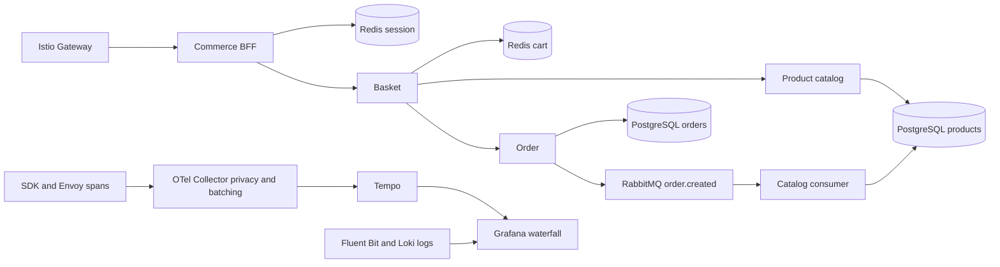

# Objective

Trace incoming HTTP/gRPC requests across all active Shopping Cart services, with 100% sampling, W3C propagation and application dependency spans. Connect RabbitMQ publish/consume work to the originating trace. Preserve existing namespaces, charts, Argo Applications, authentication and PVCs. Do not claim universal coverage from one products GET.

Central trace session: 20261002_174737. Commands run only through System/tools/run_logged.sh, sanitized notes through trace_note.sh. No credentials, raw request bodies or personal order details in saved evidence.

## Execution gates

1. [x] Inventory active runtimes, source/image parity, HTTP routes, dependency calls, current Git/Argo state and baseline capacity. Active broker verification remains in gate7.
2. [x] Configure existing Istio control plane provider and existing observability chart Telemetry resources for Gateway/apps/identity/payment. All four Telemetry resources server-dry-run passed, selectively synced; actual Envoy HTTP configuration has OTLP provider and sampling100%. Span acceptance remains gate7.
3. [x] Instrument missing application HTTP server/client/context, dependency calls and completion logs. Go SDK in account/seller/basket/BFF, Python SDK in catalog, pinned Java agent for order/payment/Keycloak; static frontend via mesh.
4. [x] Add RabbitMQ producer headers and consumer extraction/spans, retaining delivery/ack/retry semantics. Test included-router, HTTP parent-child and asynchronous propagation.
5. [x] Validate Helm/mesh/Collector config and meaningful runtime tests. Build/import immutable images sequentially. Initial six images verified18/18 node+tag+ARM64 checks; later agent/catalog/payment/order correction images passed final24/24 node+tag+ARM64 checks.
6. [x] Push Git and selectively sync existing Argo Applications one at a time. Check revision, image, native Istio sidecar readiness and real routes after each rollout. Protect database/Secrets/PVCs.
7. [x] Exercise read, auth, cart, checkout/order and order-status flows with dedicated test data where needed; no actual external payment. Confirm HTTP, DB/Redis and producer→consumer traces. Include bounded error-path tests.
8. [x] Verify Grafana/Loki correlation for new services, metrics/drop/export counters, targets, capacity and application regressions. Record an explicit coverage matrix and unresolved gaps.
9. [x] Update this plan, previous plans and repository docs, save filtered evidence and actual Grafana screenshot, commit/push and verify final Git/Argo state.

## Baseline / risk controls

- Current application images: account v0.2.2-local-20260905-country; basket v1.4.1-rabbit-20260906; BFF v0.1.5-otel-20261002; frontend canary-vn-flag-20260927-lab; order v1.1.0-local-20260905; catalog v1.4.5-otel-20261002; seller v0.1.1; payment v0.1.1; Keycloak24.0. Istio1.30.3.
- VM MemAvailable ~1.2GiB, temporary swap1GiB already in use. No parallel image builds or simultaneous app rollouts. Check memory before costly actions; pause dependent deployment and recover if headroom collapses.
- Existing Argo app degradation from ExternalSecret provider is tracked separately from actual readiness. Do not unseal Vault or change credentials to disguise status.
- Native Istio proxy can be in initContainers with restartPolicy Always; verify both regular and init container statuses.
- Istio HTTP proxy spans do not replace SQL/Redis/AMQP instrumentation. Broker consumers can run after the original HTTP response.
- Root sampling100% is a collection target, not a promise of zero span loss under failure. Track bounded exporter queues, refusal/drop counters, retention and throughput.

## Findings / plan corrections

- Initial Docker image inspection could not find payment:v0.1.1 in host Docker cache. Determine runtime from the live container/node inventory before choosing Go or Java instrumentation.
- Live payment and order are Java; deploy the verified Java agent2.31.1 through an initContainer/emptyDir in existing charts. Preserve existing live application images.
- Istio provider is merged into the existing istio ConfigMap, preserving discoveryAddress, trustDomain, metrics and meshNetworks. Existing Argo project cannot manage istio-system; keep this prerequisite explicit in Git instead of adopting the control plane or creating another Application.
- No Argo Application has automated sync enabled. Sequential selected-resource sync is therefore possible without simultaneous rollouts.
- Missing Go checksums were fixed with go mod tidy; four complete Go test suites passed after final edits. Added server/client parent tests preserve HTTP403 behavior.
- FastAPI included-router test passed in the built Python image with propagated parent and SQL dependency. Actual Pika adapter test passed for producer injection, consumer extraction/exact parent, mandatory and persistent delivery. Its first harness omitted exporter endpoint; fixed before acceptance.
- Semantic Helm review passed for eight existing application/integration charts and observability; auth/database/Secret values are unchanged. Review helper initially rejected the new Tempo logs namespace expansion; narrowed allowance to that exact query change and reran successfully.
- Five ARM64 app images built sequentially with VM MemAvailable ~1.5GiB and no new OOM. Platform-specific archive exported; final eight immutable tags verified on all three nodes.
- SDK sampler explicitly honors always_on, independent of incoming sampled flag. Propagation uses tracecontext only. Go route names omit query strings and normalize UUIDs; Redis spans omit keys/values, pgx spans omit SQL/arguments. Collector removes SQL text and full URLs.
- Trace-to-log selector expanded to apps/payment/identity/gateway namespaces. Mesh access logs contain trace ID, method, route, status and duration without request body/query/auth headers.
- First order rollout retained the old Ready pod while new agent initContainer failed: remote Docker ADD created a root-only JAR. Corrected mode0444, checked non-root read+SHA256, used new helper tag2.31.1-r1; order then Ready with zero new restarts. No securityContext weakening.
- Sequential selective Argo sync completed order/payment/Keycloak/account/seller/basket/catalog/BFF at reviewed Git revisions. Every new application and native Istio sidecar was Ready with zero new restarts. Aggregate Argo health remains Degraded due pre-existing ExternalSecret provider errors.
- Source audit found Python HTTPX AsyncClient used for JWT/JWKS. Added pinned HTTPX instrumentation, rebuilt immutable catalog v1.4.7, tested actual async HTTP child span+header propagation against a local HTTP server, rolled catalog Ready.
- Dedicated test users must include the existing required country_id attribute. The scripted gateway transport initially mishandled cookie selection after cross-host redirects; corrected test harness only. Legitimate OIDC authorization-code+PKCE login now succeeds without forging Redis sessions or weakening auth. Temporary users removed after each failed acceptance attempt.
- Real acceptance found payment401: JWKS used wrong Service port8080 instead of80 and JWT issuer did not match the public login issuer. Verified public gateway metadata; corrected issuer/JWKS URLs. Payment then403, revealing existing Spring default scope converter did not map Keycloak realm roles.
- Explicit plan exception: fix payment auth integration without bypassing JWT or changing endpoint PreAuthorize rules. Added allowlisted realm payment/platform role conversion while retaining scope authorities, ignoring unrelated client roles and malformed claims. Compiled only corrected config classes over exact live payment baseline; positive/negative/malformed tests passed against that runtime's Spring dependencies. New immutable payment v0.1.2-tracing-rolefix passed real positive/negative runtime acceptance. Full Maven/business test suite was not run for this minimal overlay.
- Broker inventory: inventory.order-created has one active consumer and zero backlog at inspection. inventory.order-cancelled, inventory.order-paid, audit.cart-events and audit.inventory-events have zero consumers. Capture producer spans but do not invent consumer spans for inactive queues; preserve all queues/messages.
- Existing service/UI tunnels survive as processes but can lose their bound pod after rollout; Keycloak port-forward was re-established after old pod removal. No persistent route/service change was needed.
- Collector actual metrics snapshot: accepted/sent9818 spans, refused0, export failures0, queue0; enqueue-failed series absent. Final post-acceptance snapshot is recorded below; cumulative counters reset after Collector rollout.

## Results

Completed and verified against real deployed services. 30 explicitly tagged HTTP requests produced666 verified spans. Test records were dedicated synthetic users/products/orders, processed by the real application/database/broker; these are not fabricated Tempo traces. A separate synthetic OTLP probe verifies privacy processors only.

### Evidence and coverage

| Component | Instrumentation | Evidence |
|---|---|---|
| Gateway / static frontend | Istio Envoy | Incoming/outgoing HTTP spans; frontend GET200. No browser JavaScript click spans. |
| commerce-bff | Go HTTP server/client, OIDC and Redis | Authentication, proxy routes, Redis spans and matching Loki completion logs. |
| account-service | Go HTTP + outbound client | Actual account request reaches Keycloak HTTP/JDBC; accounts trace239 spans. |
| seller-service | Go HTTP/client + pgx | Seller read/list, PostgreSQL operation spans and correlated logs. |
| basket-service | Go HTTP/client + Redis + AMQP producer | Read/add/checkout; Redis command/pipeline spans, W3C message headers. |
| product-catalog | FastAPI, SQLAlchemy, HTTPX, Pika | List/create/inventory/reserve; SQL/HTTPX tests and active order.created consumer exact parent. |
| order-service | Java agent2.31.1 | HTTP, JDBC and RabbitMQ publish; create/read/confirm/cancel, invalid400 and missing404. |
| payment-service | Java agent2.31.1 | Real authorized GET200 + JDBC; lacking required roles403. No external charge executed. |
| Keycloak | Java agent2.31.1 + mesh | Legitimate OIDC authorization code+PKCE login; outbound account→Keycloak and JDBC spans. |

Global server instrumentation covers business routes through the instrumented runtime, rather than a hard-coded demo endpoint. This acceptance samples representative routes, not an exhaustive test of every endpoint/input. Go/Python SDK exclude health/metrics noise; mesh can still record these requests. No active business gRPC service was identified. Arbitrary background jobs/custom unsupported clients need their own context instrumentation.

| Actual request | HTTP | Spans | Trace ID |
|---|---:|---:|---|
| Checkout | 200 | 46 | 82c6473ab4824909873b8c3e33dc8676 |
| Confirm checkout order | 200 | 17 | a6c8478a82154229a5554df2935db0a5 |
| Create order | 201 | 20 | bcb10073bf88419b931da1aee354b0a1 |
| Confirm direct order | 200 | 17 | 6edd12dff7cc47cab7585c378860def7 |
| Payment read | 200 | 13 | 61fe52be641e4cdc9dc550e9a1ded78c |
| Accounts | 200 | 239 | 9cbbe064c3a94f26b6bc73390fb80192 |
| Frontend | 200 | 3 | cf21564d264b414fa68ade721215a17a |
| Invalid order | 400 | 10 | 5057fe9adae34d529cea9e307180c2a8 |
| Missing order | 404 | 12 | 17bdebfd58e341a8a09576b568d5369c |

Checkout waterfall measured386.36ms and9 service entries, including SDK/proxy entries for the same workload. Order Java PRODUCER→catalog Python CONSUMER has the exact parent span ID in the same trace. SQLAlchemy/JDBC/pgx/Redis dependencies verified. Creating and later confirming an order are separate HTTP requests/traces; they are not automatically one permanently open trace.



Grafana datasource proxy returned the same46 checkout spans as direct Tempo. Actual UI screenshot: [grafana-full-trace.jpg](grafana-full-trace.jpg). Open Explore→Tempo→Trace ID with the IDs above while retained data exists. Logs matching trace IDs were found for accounts, seller, payment, checkout, order-confirm and invalid-order across apps/payment/identity/gateway; Grafana derived trace links verified. Log records and span records remain separate signals.

### Corrections discovered during execution

1. Java agent remote ADD had root-only permissions: fixed0444, validated official SHA256 and non-root read, new2.31.1-r1 image; original Ready pod retained until corrected rollout.
2. Catalog's async JWT/JWKS HTTPX client was missing instrumentation: added pinned instrumentor and actual async propagation test.
3. Payment issuer/JWKS mismatch caused401, then missing realm-role conversion caused403. Corrected public issuer/internal Service80 and strict allowlisted converter retaining scope authorities and endpoint authorization.
4. Order status constraint excluded CONFIRMED/DELIVERED, despite app enum/routes accepting them. Bounded additive SQL migration retains all old statuses, validates existing rows and uses5s lock/30s statement timeouts. No rows/PVCs deleted. Migration script is an explicit prerequisite, not an Argo hook.
5. Order ERROR dispatch masked errors as403. Permitted ERROR dispatcher only, preserving ordinary route authentication/authorization. Actual invalid400, missing404 and role-denied403 verified.
6. Collector now also removes exception.message, exception.stacktrace and status.message; retains exception.type/status.code. Live synthetic regression probe passed. Config checksum hashes actual Collector configuration and triggered correct rollout.
7. Dedicated acceptance required country_id and domain-correct OIDC cookie handling. Corrected test harness, used legitimate PKCE login; no forged signed sessions.

Temporary users deleted, BFF sessions logged out, synthetic product soft-deactivated, test orders cancelled including the specifically identified previous failed test order. Cancelled order history and broker messages retained. Remaining temporary cart entries follow existing Redis TTL. No external payment, production record purge, namespace deletion, Vault action or root/security broad sync.

### Capacity, broker and monitoring snapshot

Final snapshot:35/35 Prometheus targets UP; Collector accepted3110/sent3108, refused0/export-failed0/queue0. Counts are a point-in-time cumulative snapshot with batching/in-flight differences, not a zero-loss theorem. Enqueue-failed series absent (unknown, not measured zero). Existing ShoppingTracingTargetDown/ShoppingTraceExportFailed rules loaded.

VM MemTotal9936MiB, MemAvailable1372MiB, swap1023MiB total/125MiB free; all nodes Ready without MemoryPressure/DiskPressure. Eight changed apps/native proxies Ready with zero new restarts; unchanged frontend has historical restart counts, not a zero-restart claim for the whole cluster. Snapshot pod memory includes sidecars: Tempo261MiB, Collector82MiB, Grafana622MiB, Prometheus621MiB, order467MiB, payment568MiB, Keycloak594MiB. CPU observed: Tempo9m, Collector5m, Grafana15m, Prometheus27m; these are light-load snapshots, not production capacity estimates.

RabbitMQ inventory.order-created:1 consumer, ready0/unacked0. Inactive queues preserved: inventory.order-cancelled ready6, inventory.order-paid ready9, audit.cart-events ready19, audit.inventory-events ready2; all consumers0. Producer spans exist where published, but consumer spans cannot exist without a running consumer. Adding these business consumers would be a separate implementation, not a tracing configuration fix. Dead-letter queue ready0.

Sampling100% configured; single-replica local Tempo/Collector and finite buffers/PVCs are not HA. Tempo48h, Loki48h, Prometheus3d/3GB retention. Archived filtered JSON/screenshot survives live trace expiry. Native frontend HTTP is traced, browser click-to-render activity is not instrumented. No load/HA/chaos test was performed. Four Go suites, Python HTTP/SQL/AMQP/HTTPX tests, Java runtime role converter tests/config compile, Helm/Collector checks and real HTTP acceptance passed; full Maven/business suite was not run for the minimal Java overlays.

### Final Argo state

shopping-observability:Synced/Healthy, operationSucceeded at18b01fa. basket/BFF/catalog/order/payment:Synced with pre-existing ExternalSecret-related Degraded status. account/seller:OutOfSync for Service/ServiceAccount/ExternalSecret outside selected resources; tracing Deployment/ConfigMap rollout succeeded. shopping-integration:OutOfSync for existing data/gateway/realm/namespace resources outside selected Keycloak rollout. Do not mistake selected-resource success for all Applications being Healthy. Exact revision/status inventory is saved in full-tracing-final-inventory.json.

Code/config revisions pushed to existing dev:4d3fb41,8b9c379,65cd9dc,0c94f1c,6f16f7f,18b01fa. Final documentation commit is verified separately in central logs to avoid self-referential commit hashes.

### Reproduction / safe Argo CD operation

Use the existing charts/Applications and namespace shopping-cart-observability. Never create a replacement monitoring namespace/Application. All commands below use the required central trace entry point. Set these variables in the shared terminal; use an existing trace, or initialize a new conversation exactly once with trace_session_init.sh --new.

```sh
ROOT=/Users/phamquangtrung/Documents/Agent_setup
RUN="$ROOT/System/tools/run_logged.sh"
ART="$ROOT/Artifacts/shopping-metrics-plan"
REPO="$ROOT/Artifacts/shopping-cart-k8s-publish"
PY="$ART/.venv/bin/python"
"$RUN" kubectl config current-context
"$RUN" git -C "$REPO" status --short
"$RUN" git -C "$REPO" ls-remote origin refs/heads/dev
```

1. Render/review existing charts privately; do not print Secret manifests. Tests/build commands and per-image recovery are in central command logs. Runtime images must be built/imported on each k3d node or published to a reachable registry before sync. Immutable tags are in full-tracing-final-inventory.json. Local images were imported to all3 nodes (24/24 checks); no remote application-image registry publication is claimed. Java security overlays require the exact historical base images named in their Dockerfiles.
2. Explicit Istio prerequisite: merge tracked provider into existing mesh, preserving discovery/trust/metrics/meshNetworks. Existing Argo project cannot manage istio-system. This helper refuses conflicting provider definitions.

```sh
"$RUN" "$PY" "$REPO/shopping-observability/configure-istio-tracing.py"
"$RUN" "$PY" "$ART/migrate-order-status.py"
```

The database helper verifies primary, existing expected constraint and skips already-compatible migration. Review the Git SQL first. Existing order Hibernate ddl-auto=validate does not execute this migration automatically.

3. Commit/push reviewed config to existing dev before deployment. Sync existing shopping-observability selectively (existing helper --tracing-only), then one application at a time using sync-tracing-app.py and wait-full-rollout.py. Each sync pins both multi-source revisions to pushed HEAD, disables prune and checks VM headroom700MiB. Verify operationSucceeded AND new live image/generation/readiness, not just an old pod's rollout status.

```sh
"$RUN" "$PY" "$ART/sync-existing-observability.py" "$REPO" --tracing-only
"$RUN" "$PY" "$ART/sync-tracing-app.py" order-service
"$RUN" "$PY" "$ART/wait-full-rollout.py" order-service
```

Repeat the last two commands sequentially for payment-service, shopping-integration (Keycloak only), account-service, seller-service, basket-service, product-catalog, commerce-bff. In Argo UI choose only the app Deployment, app-config ConfigMap and reviewed DestinationRule. For shopping-integration select only Deployment/keycloak and ConfigMap/keycloak-config; NEVER select keycloak-realm, database/broker StatefulSets, Secret/PVC or namespace resources. No root/security app sync. Observability selection includes Collector/Tempo configuration and namespace Telemetry, without touching unrelated alert credentials.

4. Keep Grafana3000, Prometheus9090, Tempo3200, Loki3100 and app gateway available during verification. These UI ports are local port-forwards; they must be restarted if the bound pod is replaced. The application's public gateway routing remains unchanged. Documentation-only commits do not require re-syncing/restarting unchanged workloads.

```sh
"$RUN" "$PY" "$ART/final-full-tracing-inventory.py"
"$RUN" "$PY" "$ART/full-tracing-acceptance.py"
"$RUN" "$PY" "$ART/verify-full-tracing.py"
"$RUN" "$PY" "$ART/verify-tracing-privacy.py"
```

Acceptance creates dedicated test records and performs legitimate admin flow; review before rerunning, because it creates/cancels orders. Credentials are read internally and never printed. After acceptance verify cleanup, exact AMQP parent, Loki matching trace IDs, Grafana datasource/UI and Collector metrics. Do not rerun mutation helpers that assembled source/config: they are historical one-time preparation scripts. Use Git as the final desired state.

### Saved artifacts

- full-tracing-evidence.json: filtered per-request/per-span metadata, async parent, log matches, initial acceptance metrics.
- full-tracing-final-inventory.json: final image/node/pod/capacity/Argo/broker/metrics snapshot.
- full-tracing-privacy-evidence.json: independent synthetic privacy processor regression.
- grafana-full-trace.jpg: actual Grafana waterfall screenshot, not a mock dashboard.
- Central command/session logs: Agent_setup/Log_agents/command_logs_20261002_174737.log and session_logs_20261002_174737.log. Historical plan corrections and failed command diagnostics are retained there.


## Access-log correlation correction (2026-10-03)

Status: executing. User inspection exposed a coverage gap: Uvicorn default product-detail access log contains product UUID but no trace ID; normalized completion logs contain trace ID but not UUID. Prior full tracing acceptance did not verify correlation on this exact log type.

Plan: (1) add context filter and allowlisted JSON formatter to uvicorn.access; retain method/path/status, strip query/client/header/body; (2) real Uvicorn included-router concurrent-request regression checks span-ID existence/context isolation/privacy; (3) build immutable catalog v1.4.8-access-trace-20261003, import all3 ARM64 nodes, update existing chart/local values; (4) push Git then selectively sync product-catalog only and verify new pod+native proxy readiness; (5) actual GET product UUID→same access-log line with trace ID→Tempo HTTP+SQL spans and Grafana derived-link match; (6) update final evidence/results and commit docs. Existing logs are historical and cannot be retroactively changed. No auth/data/namespace or other-service changes. All commands central session20261002_174737.


### Access-log correction acceptance result

Status: completed. Code/config commit1116e93 pushed to existing dev; catalog v1.4.8-access-trace-20261003 available as ARM64 on all3 nodes. Existing product-catalog Argo selected-resource operationSucceeded; new pod and native Istio proxyReady, restarts0. Aggregate app Degraded remains the existing ExternalSecret issue.

Real Uvicorn test passed8 concurrent included-router requests with separate propagated trace IDs; each logged span ID exists in exported trace. Startup-order regression uses default Uvicorn logging config and app lifespan reconfiguration to prevent handler reset. Allowlisted JSON access record includes event/service/level/method/path/status/trace_id/span_id; query strings, client IP, headers/cookies/body omitted. Excluded health/ready requests have no fake trace IDs.

Actual read-only public GET through Gateway on07:59:53 returned200. New access log contains the requested product UUID and trace2e6c0a889a15447ca300357ed01d2c87;12 spans include gateway/BFF/catalog/PostgreSQL. Logged span103a8a830db09ea3 exists in that exact trace. Query probe parameter removed. Existing Grafana Loki derived-field regex matches this exact line; actual UI showed TraceID100% and the same trace_id/span_id. Fluent Bit Merge_Log flattens JSON and adds metadata; acceptance harness initially rejected these enrichment fields, corrected only harness allowlist and reran successfully.

Saved filtered proof: catalog-access-correlation-evidence.json. Central command/session logs retain tests/build/import/sync and verification. Screenshot persistence was blocked by browser session ownership errors after visible UI verification; no screenshot claimed. Historical access logs cannot gain trace IDs retroactively. X-Trace-Id response headers are outside this correction; browser Network still does not receive that header. Other runtimes/loggers were not changed.

To verify on Grafana Loki, set Last15minutes (or the appropriate interval) and use:

```logql
{job="fluent-bit", kubernetes_namespace_name="shopping-cart-apps", kubernetes_container_name="product-catalog"} |= "386d7692-9f8e-49d9-a842-43404cf083a6"
```

Open a new http_access line, read trace_id and use its Tempo derived link. For isolated acceptance proof add |= "2e6c0a889a15447ca300357ed01d2c87". Repeat real GET after deployment to inspect new logs rather than pre-change lines. Reproduce code test via logged docker run mounting tests/unit/test_access_trace.py into the immutable image. Reproduce live verification via Artifacts/shopping-metrics-plan/verify-catalog-access-correlation.py; it reads a public product and captures no response body/credentials.
