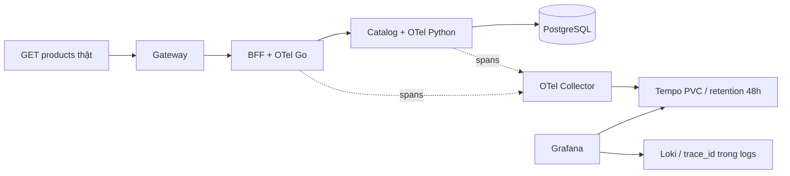

# Mục tiêu và phạm vi

Dựng đủ Tempo, OTel Collector và instrumentation ứng dụng. Nghiệm thu một request đọc danh sách sản phẩm thật qua Gateway → commerce-bff (Go) → product-catalog (FastAPI) → PostgreSQL. Không gửi trace giả trực tiếp vào Tempo. Chỉ luồng này được chứng minh; chưa tuyên bố trace checkout/RabbitMQ/payment toàn hệ thống.

Giữ namespace `shopping-cart-observability`, chart `shopping-observability/helmchart`, Argo Application `shopping-observability`, datasource/dashboard Grafana hiện có. Instrumentation nằm trong source và chart của hai service hiện có. Không tạo namespace/chart/Application mới. Giữ dữ liệu PVC hiện tại.

## Trước khi triển khai

- [x] Xác nhận trace session `20261002_174737`; mọi lệnh đi qua `System/tools/run_logged.sh`.
- [x] Đọc memory/runbook; Git dev sạch; các pod shopping hiện chạy. Nhiều Argo app đã OutOfSync/Degraded trước task: phải review diff, chỉ deploy phần đã kiểm tra.
- [x] Chọn luồng public GET `/api/v2/products` qua BFF và truy vấn DB thật.
- [x] Chụp cấu hình baseline đã lọc bí mật; review Helm overrides và deployment diff.

## Thiết kế đã triển khai

- Tempo `grafana/tempo:2.9.0` (release đã xác minh), monolithic, 1 replica, PVC local-path 5Gi, retention 48h, requests 100m/256Mi, limits 1000m/1Gi. OTLP chỉ ClusterIP. WAL/block local; PVC không phải hard quota trên local-path. Pin PVC Retain sau khi tạo.
- Collector `otel/opentelemetry-collector-contrib:0.140.0` (release đã xác minh), 1 replica, OTLP gRPC 4317 + HTTP 4318. Pipeline traces: memory_limiter → batch → OTLP Tempo, timeout/retry + bounded sending queue. Requests 50m/64Mi, limits 500m/256Mi. Queue memory, không hứa zero-loss khi Collector restart; retention do Tempo xử lý.
- Go OTel SDK/exporter + otelhttp server/client, W3C traceparent propagation. Exclude health probes; bounded export, shutdown flush.
- Python SDK/exporter + FastAPI + SQLAlchemy instrumentation. Không capture headers/body/SQL parameters; strip DB query text ở Collector nếu instrumentation tạo statement. Exclude health/metrics. Correlate trace_id vào request completion logs không chứa auth/personal data.
- Sampling ParentBased 100% cho phạm vi hai service hiện tại, để request thật dễ chứng minh. Không thêm Operator hoặc sidecar Collector mỗi pod.
- Grafana thêm datasource UID `tempo`, link traces → Loki theo trace_id. Prometheus scrape self-metrics của Tempo/Collector; kiểm tra targets và export failures.

## Trình tự thực thi

1. [x] Review baseline, Helm render; bổ sung tracing templates trong chart hiện có và OTel source/config cho hai ứng dụng.
2. [x] Kiểm tra cấu hình Tempo/Collector bằng image chính thức; Helm lint/template; test HTTP context propagation và Python instrumentation.
3. [x] Build image ứng dụng có tag mới, import vào đúng k3d cluster; cập nhật Git local overrides để Argo tái triển khai đúng image.
4. [x] Push dev; sync observability từ revision đã push, không prune. Chờ Tempo/Collector Ready và datasource healthy.
5. [x] Review diff app; sync lần lượt product-catalog rồi BFF. Không ghi đè Secret/PVC/những app ngoài phạm vi. Rollback nếu readiness hoặc GET products thất bại.
6. [x] Gửi request thật với W3C traceparent ID duy nhất qua Gateway. HTTP 200; tìm cùng ID trong Tempo; kiểm tra parent-child BFF client → catalog server và DB span trong catalog.
7. [x] Kiểm tra Grafana Tempo datasource/API, trace → logs Loki, metrics target UP/export success; kiểm tra frontend/login và product API, pod restarts/resource snapshot.
8. [x] Lưu evidence đã lọc không có credentials/body/SQL; tạo Mermaid/visual trace tree; cập nhật plan này, PLAN.md và PLAN_FLUENTBIT_LOKI.md.
9. [x] Commit/push cuối; xác minh remote SHA, Argo revision/health; trả kết quả thật và giới hạn đã kiểm chứng.

## Entry points và lệnh vận hành

Mọi lệnh dưới đây chạy với prefix `/Users/phamquangtrung/Documents/Agent_setup/System/tools/run_logged.sh`. Repo: `Artifacts/shopping-cart-k8s-publish`. Context: `k3d-lab-k8s`.

```bash
helm lint Artifacts/shopping-cart-k8s-publish/shopping-observability/helmchart
python3 Artifacts/shopping-metrics-plan/sync-existing-observability.py Artifacts/shopping-cart-k8s-publish --tracing-only
python3 Artifacts/shopping-metrics-plan/sync-tracing-app.py product-catalog
python3 Artifacts/shopping-metrics-plan/sync-tracing-app.py commerce-bff
kubectl --context k3d-lab-k8s -n shopping-cart-observability rollout status statefulset/tempo --timeout=180s
kubectl --context k3d-lab-k8s -n shopping-cart-observability rollout status deployment/otel-collector --timeout=180s
kubectl --context k3d-lab-k8s -n shopping-cart-observability port-forward svc/tempo 3200:3200
python3 Artifacts/shopping-metrics-plan/verify-tracing.py
```

## Argo CD sau bootstrap

Source of truth: existing chart + `config-secret-secure/values/local/22-product-catalog.yaml` và `25-commerce-bff.yaml`. Build/import image mới trước sync (repo hiện dùng image local). Push Git → Refresh/Diff existing Applications → sync observability → catalog → BFF. Chọn commit đã push cho cả hai sources, prune=false. Không sync root app hoặc data stack để hoàn thành tracing.

## Rollback

Trước deploy ghi lại image/tag và deployment baseline đã lọc. Nếu app lỗi, quay lại image/config revision cũ qua Git/Argo; giữ PVC Tempo để không mất trace. Không xoá cả namespace, không rollback observability về phiên bản tắt Loki. Instrumentation có switch env tắt tracing. Nếu chỉ Collector/Tempo lỗi, app vẫn xử lý nghiệp vụ, exporter không được chặn request.

## Nhật ký sai lệch / sửa plan

- Skill `trace-runner` không tồn tại trong catalog/workspace; tiếp tục dùng các approved trace entry points theo AGENTS.md.
- BFF là Go, không có pom.xml; chọn OTel Go SDK. SQLAlchemy ở catalog cho dependency spans.
- Lệnh inventory Argo ban đầu có bracket chưa quote, bị zsh chặn; đã quote custom-columns và chạy lại thành công, không mutation.
- Python hệ thống/bundled không có PyYAML: dùng task venv hiện có `.venv` với PyYAML 6.0.3, không cài global.
- Override catalog giữ image cũ v1.3.2, BFF replicaCount=2 trong khi live=1: cập nhật tag tracing và giữ replica=1. Helm diff chỉ image/config OTel/checksum và Kubernetes default fields; không đổi auth/DB/Secret references.
- Tempo `-config.verify` cần giá trị string: đã sửa `-config.verify=true`, exit 0. Collector `validate` exit 0.
- `k3d image import` trực tiếp các image đa kiến trúc báo thiếu digest nhưng trả exit 0 và misleading success. Chưa deploy; xuất archive riêng `docker save --platform=linux/arm64`, import archive và xác minh inventory từng node.
- Import ARM64 thành công; xác minh đủ cả bốn image trên server-0/agent-0/agent-1. Go suite/HTTP parent-child test pass; Python runtime TestClient + SQLAlchemy/W3C propagation test pass (5 spans).
- Git triển khai đầu: `d8b49a606c2d15ec8002cab091bb7ea40251da86`, push dev. Argo observability bắt đầu sync, Tempo/Collector chạy; catalog selective sync Deployment/ConfigMap/DestinationRule thành công, giữ Secrets/PVC ngoài scope.
- Sự cố runtime khi rollout catalog: API TLS và Grafana timeout. Rancher VM 9.7GiB RAM, MemAvailable ~66MiB, SwapTotal=0, loadavg~236, ~90% sys CPU/kswapd. Dừng rollout BFF để khôi phục điều khiển. Đã tạo swap tạm 1GiB **trong Linux VM** (khác swap macOS), không cấu hình fstab/khởi động tự động. MemAvailable sau enable tăng ~322MiB; vẫn phải kiểm chứng API và workload phục hồi.

## Swap tạm để phục hồi VM khi rollout

Lệnh đã thực thi qua trace runner:

```bash
rdctl shell sudo dd if=/dev/zero of=/var/lib/shopping-observability-recovery.swap bs=1M count=1024
rdctl shell sudo chmod 600 /var/lib/shopping-observability-recovery.swap
rdctl shell sudo mkswap /var/lib/shopping-observability-recovery.swap
rdctl shell sudo swapon /var/lib/shopping-observability-recovery.swap
rdctl shell cat /proc/meminfo
```

Giữ swap tạm trong phiên triển khai, không coi đây là đủ capacity lâu dài. Khi RAM khả dụng đủ lớn hơn swap đang dùng, có thể gỡ bằng `rdctl shell sudo swapoff /var/lib/shopping-observability-recovery.swap` rồi xóa đúng file này. Không swapoff khi VM vẫn thiếu RAM; thao tác có thể làm máy thrash lại. Không thay đổi RAM/CPU settings hoặc restart toàn VM.

### Recovery thực tế

- Xác nhận global OOM qua `rdctl shell sudo dmesg`: Argo controller bị kill. Docker server-0 `OOMKilled=true`, exited, restartPolicy=no. Khởi động **đúng container cũ** bằng `docker start k3d-lab-k8s-server-0`, không recreate/node deletion; ba node trở lại Ready. Bộ nhớ/CPU VM phục hồi.
- Catalog startup lỗi PostgreSQL connection closed. Pgpool logs `all backend nodes are down`, yêu cầu restart. Kiểm tra cả products-0/1 và orders-0/1 bằng `pg_isready -U postgres -d postgres`: accepting connections. Default pg_isready không có user/db trả `no attempt`, nên sửa lệnh trước khi chốt DB healthy.
- Restart đúng deployment `postgresql-products-pgpool` và `postgresql-orders-pgpool` để bỏ trạng thái backend-down cũ, không thay database/schema/PVC. Restart catalog để thoát CrashLoop backoff. Kiểm chứng lại app sau recovery.
- Port-forwards cũ không tự phục hồi sau API server restart. Tạo forward mới: Grafana test 3001 trả HTTP200, Tempo3200 `/ready` HTTP200; nối lại các cổng chuẩn sau đó.
- Catalog Ready nhưng GET sản phẩm 500: OTel FastAPI 0.52b0 không hỗ trợ `_IncludedRouter` của FastAPI mới. Test route trực tiếp pass nhưng không đủ đại diện; sửa regression test dùng APIRouter/include_router, nâng cặp SDK/exporter 1.45.0 + instrumentation 0.66b0 (PyPI xác minh), build tag mới v1.4.4. Không hạ FastAPI/đổi nghiệp vụ để né lỗi. Nguồn: https://github.com/open-telemetry/opentelemetry-python-contrib/releases/ (fix #4700).

## Visualize kiến trúc



## Kết quả nghiệm thu

Nghiệm thu lúc 2026-10-02T16:22:19.603521+00:00 (23:22:19 giờ Việt Nam):

| Kiểm tra | Kết quả thực tế |
|---|---|
| GET qua Gateway `/api/v2/products?page=1&page_size=5` | HTTP 200; đọc DB thật |
| Trace ID | `c4963fc6dbca43f1ac760d6990e9b2ff` |
| Spans | 9; 2 application services + PostgreSQL client dependency |
| BFF server / HTTP client | 62.107 ms / 61.681 ms |
| Catalog server / DB SELECT | 22.836 ms / 3.185 ms và 0.658 ms |
| W3C và parent-child | Incoming traceparent giữ nguyên; BFF client là parent của catalog server |
| Grafana Tempo | Datasource health OK; proxy trả đủ 9 spans; browser đã hiển thị waterfall |
| Logs → trace | Regex nhận được trace ID trong cả JSON catalog và JSON escaped của BFF |
| Trace → logs | Loki tìm được cùng trace_id trong cả hai service |
| Metrics | 35/35 targets UP, có Tempo + Collector + 11 Istio Envoy targets |
| Alerts tracing | ShoppingTracingTargetDown và ShoppingTraceExportFailed đã được Prometheus load |
| Export snapshot | accepted 998 / sent 996 / failed 0; counters tại một lần scrape, chênh lệch nhỏ có thể do batch đang chờ |
| Grafana live dashboard | Giữ 9 panels; thêm link Traces — Tempo tới tìm trace commerce-bff |
| Pods cuối | BFF v0.1.5-otel-20261002, catalog v1.4.5-otel-20261002 Ready; app và native istio-proxy 0 restarts |
| Argo | Observability Synced/Healthy/Succeeded; hai app Synced/Degraded/Succeeded do ExternalSecret provider có lỗi từ trước |
| Git runtime | `0f7d73f17ce47c8d2b13b6e4e45c12c327e25356` trên origin/dev |

Evidence: `tracing-evidence.json`, `logging-evidence.json`, ảnh `grafana-tempo-trace.jpg`. Ảnh là UI Grafana của request thật, không phải sơ đồ dựng giả. Không lưu response body, SQL text, auth header hoặc credentials trong evidence.

### Giới hạn đã ghi nhận

- Chứng minh GET danh sách sản phẩm qua hai ứng dụng và dependency PostgreSQL; chưa instrument browser/Gateway, checkout, payment hay RabbitMQ. DB span là client span từ SQLAlchemy, không phải PostgreSQL server tự phát span.
- Đã dựng đầy đủ Tempo, Collector và SDK cho luồng này. Tempo monolithic 1 replica/local PVC; Collector 1 replica/queue RAM. Không phải HA, không bảo đảm zero-loss khi node/Collector lỗi.
- Retention Tempo 48h đã cấu hình compactor, PVC 5Gi và PV Retain. Chưa chờ 48h để nghiệm thu việc xóa block; local-path capacity không phải hard quota. Sampling 100% cho hai ứng dụng làm dữ liệu tăng theo traffic.
- Snapshot sau request: Tempo 435Mi/5m CPU, Collector 46Mi/6m CPU, tổng thêm khoảng 481Mi/11m. Đây là thời điểm đo, không phải mức sử dụng cố định hay kiểm thử tải dài hạn.
- VM còn khoảng 1.6GiB MemAvailable sau build; swap tạm 1GiB dùng khoảng 782MiB. Có sự cố global OOM trong rollout đã phục hồi; chưa coi capacity này đủ ổn định lâu dài. Không tự swapoff lúc RAM chật.
- ExternalSecret BFF/catalog vẫn Ready=False/SecretSyncedError; Secret hiện hữu đủ để app hoạt động. Không unseal Vault hoặc thay credentials trong task tracing.

### Xem trên Grafana

Mở `http://localhost:3000` khi port-forward Grafana hoạt động → Explore → datasource Tempo → TraceQL → dán trace ID ở trên. Trace có thể hết retention sau 48h. Với trace mới, dùng Search hoặc TraceQL `{ resource.service.name = "commerce-bff" }` và chọn request.

Trong Loki Explore query:

```logql
{job="fluent-bit",kubernetes_namespace_name="shopping-cart-apps"} |= "c4963fc6dbca43f1ac760d6990e9b2ff"
```

Mở log details và derived field TraceID để quay lại Tempo; trong trace dùng Logs for this span. Dashboard Shopping Cart — Live Metrics có link Traces — Tempo.


## Sửa đổi cuối so với plan

- OTel Python 0.52b0 gây GET500 khi FastAPI dùng included router; đã nâng SDK/exporter1.45.0 + instrumentation0.66b0 và test APIRouter thực tế. Bản image cuối catalog v1.4.5 ghi completion INFO.
- Go suite gồm HTTP proxy W3C parent-child pass. BFF v0.1.5 chờ HTTP server drain trước khi flush SDK. Docker build/import chạy tuần tự để giảm peak RAM.
- BFF final build ban đầu có repository alias shopping-cart-commerce-bff, trong khi chart dùng commerce-bff: retag cùng image đã test, import đúng tên rồi xác minh rollout. Không sửa chart để đổi naming hiện hữu.
- Native Istio sidecar nằm trong initContainers với restartPolicy Always. Inventory chỉ spec.containers làm hiểu nhầm thiếu proxy; đã kiểm tra initContainerStatuses và istiod xDS, xác nhận đầy đủ, không đổi admission.
- Loki derived field regex cũ không đọc JSON escaped BFF: sửa `trace_id[^a-f0-9]+([a-f0-9]{32})`, nghiệm thu cả hai service.
- Argo sync toàn stack trước đó thất bại khi API timeout/OOM. Bản cuối sync chọn đúng Tempo/Collector ConfigMap/workload, datasource/dashboard ConfigMap và PrometheusRule, SSA, prune=false, không chạy hooks/CRDs/data stack.
- Helper sync app chỉ nhận tên ứng dụng; lần truyền thêm repo bị assertion chặn trước mutation, đã sửa cú pháp. Một trace-note thiếu quote bị shell chặn và đã log correction ngay.

## Lệnh tái build và vận hành bằng Argo CD

Từ workspace Agent_setup, mỗi dòng lệnh phải thêm prefix `System/tools/run_logged.sh` theo trace policy. Không sao chép token vào command hoặc Git.

```bash
git -C Artifacts/shopping-cart-k8s-publish checkout dev
helm lint Artifacts/shopping-cart-k8s-publish/shopping-observability/helmchart
docker build -t commerce-bff:v0.1.5-otel-20261002 Artifacts/shopping-cart-k8s-publish/commerce-bff
docker build -f Artifacts/shopping-cart-k8s-publish/shopping-cart-product-catalog/Dockerfile.telemetry -t shopping-cart-product-catalog:v1.4.5-otel-20261002 Artifacts/shopping-cart-k8s-publish/shopping-cart-product-catalog
docker save --platform=linux/arm64 -o Artifacts/shopping-metrics-plan/final-tracing-arm64.tar commerce-bff:v0.1.5-otel-20261002 shopping-cart-product-catalog:v1.4.5-otel-20261002
k3d image import Artifacts/shopping-metrics-plan/final-tracing-arm64.tar -c lab-k8s
# For a source change use fresh immutable tags, update both local override and chart defaults, test, review diff, commit/push dev first.
python3 Artifacts/shopping-metrics-plan/sync-existing-observability.py Artifacts/shopping-cart-k8s-publish --tracing-only
python3 Artifacts/shopping-metrics-plan/sync-tracing-app.py product-catalog
kubectl --context k3d-lab-k8s -n shopping-cart-apps rollout status deployment/product-catalog --timeout=45s
python3 Artifacts/shopping-metrics-plan/sync-tracing-app.py commerce-bff
kubectl --context k3d-lab-k8s -n shopping-cart-apps rollout status deployment/commerce-bff --timeout=45s
python3 Artifacts/shopping-metrics-plan/verify-tracing.py
```

Argo UI tương đương: mở đúng existing Application → Refresh → Diff → chọn Deployment/ConfigMap/DestinationRule của mỗi app hoặc exact tracing resources của stack → sync revision dev đã push cho cả hai sources, prune=false. Xác minh pod tag/Ready và operation Succeeded; rollout status đơn độc có thể trả thành công trước khi Argo cập nhật Deployment. Không sync root ApplicationSet hoặc database chỉ để cập nhật tracing.

Image đang import local: Git/Argo không tự build hoặc phân phối image. Sau recreate node cần build/import lại; để dùng nhiều host cần registry và cập nhật repository/tag theo quy trình riêng. Không tuyên bố Git alone khôi phục đủ image.

## Execution logs

Regression metrics cuối: 30/30 GET products HTTP200 trong30.8s. Istio sau scrape: BFF ~0.108RPS, catalog ~0.109RPS; p95 BFF42.63ms/catalog36.88ms, p99 BFF83.84ms/catalog47.38ms theo histogram 5m. Đây là traffic đọc thật có giới hạn; dịch vụ không có traffic vẫn có thể hiển thị NaN ở percentile, không điền số giả.

- `Log_agents/command_logs_20261002_174737.log`
- `Log_agents/session_logs_20261002_174737.log`

Logs nằm trong workspace Agent_setup, không đưa raw logs/Secrets vào Git. Các plan được copy vào `shopping-observability/docs/` trong Git để review; helper/evidence/ảnh giữ ở artifact local.

## Sửa đổi cuối so với plan

- OTel Python 0.52b0 gây GET500 khi FastAPI dùng included router; đã nâng SDK/exporter1.45.0 + instrumentation0.66b0 và test APIRouter thực tế. Bản image cuối catalog v1.4.5 ghi completion INFO.
- Go suite gồm HTTP proxy W3C parent-child pass. BFF v0.1.5 chờ HTTP server drain trước khi flush SDK. Docker build/import chạy tuần tự để giảm peak RAM.
- BFF final build ban đầu có repository alias shopping-cart-commerce-bff, trong khi chart dùng commerce-bff: retag cùng image đã test, import đúng tên rồi xác minh rollout. Không sửa chart để đổi naming hiện hữu.
- Native Istio sidecar nằm trong initContainers với restartPolicy Always. Inventory chỉ spec.containers làm hiểu nhầm thiếu proxy; đã kiểm tra initContainerStatuses và istiod xDS, xác nhận đầy đủ, không đổi admission.
- Loki derived field regex cũ không đọc JSON escaped BFF: sửa `trace_id[^a-f0-9]+([a-f0-9]{32})`, nghiệm thu cả hai service.
- Argo sync toàn stack trước đó thất bại khi API timeout/OOM. Bản cuối sync chọn đúng Tempo/Collector ConfigMap/workload, datasource/dashboard ConfigMap và PrometheusRule, SSA, prune=false, không chạy hooks/CRDs/data stack.
- Helper sync app chỉ nhận tên ứng dụng; lần truyền thêm repo bị assertion chặn trước mutation, đã sửa cú pháp. Một trace-note thiếu quote bị shell chặn và đã log correction ngay.

## Lệnh tái build và vận hành bằng Argo CD

Từ workspace Agent_setup, mỗi dòng lệnh phải thêm prefix `System/tools/run_logged.sh` theo trace policy. Không sao chép token vào command hoặc Git.

```bash
git -C Artifacts/shopping-cart-k8s-publish checkout dev
helm lint Artifacts/shopping-cart-k8s-publish/shopping-observability/helmchart
docker build -t commerce-bff:v0.1.5-otel-20261002 Artifacts/shopping-cart-k8s-publish/commerce-bff
docker build -f Artifacts/shopping-cart-k8s-publish/shopping-cart-product-catalog/Dockerfile.telemetry -t shopping-cart-product-catalog:v1.4.5-otel-20261002 Artifacts/shopping-cart-k8s-publish/shopping-cart-product-catalog
docker save --platform=linux/arm64 -o Artifacts/shopping-metrics-plan/final-tracing-arm64.tar commerce-bff:v0.1.5-otel-20261002 shopping-cart-product-catalog:v1.4.5-otel-20261002
k3d image import Artifacts/shopping-metrics-plan/final-tracing-arm64.tar -c lab-k8s
# For a source change use fresh immutable tags, update both local override and chart defaults, test, review diff, commit/push dev first.
python3 Artifacts/shopping-metrics-plan/sync-existing-observability.py Artifacts/shopping-cart-k8s-publish --tracing-only
python3 Artifacts/shopping-metrics-plan/sync-tracing-app.py product-catalog
kubectl --context k3d-lab-k8s -n shopping-cart-apps rollout status deployment/product-catalog --timeout=45s
python3 Artifacts/shopping-metrics-plan/sync-tracing-app.py commerce-bff
kubectl --context k3d-lab-k8s -n shopping-cart-apps rollout status deployment/commerce-bff --timeout=45s
python3 Artifacts/shopping-metrics-plan/verify-tracing.py
```

Argo UI tương đương: mở đúng existing Application → Refresh → Diff → chọn Deployment/ConfigMap/DestinationRule của mỗi app hoặc exact tracing resources của stack → sync revision dev đã push cho cả hai sources, prune=false. Xác minh pod tag/Ready và operation Succeeded; rollout status đơn độc có thể trả thành công trước khi Argo cập nhật Deployment. Không sync root ApplicationSet hoặc database chỉ để cập nhật tracing.

Image đang import local: Git/Argo không tự build hoặc phân phối image. Sau recreate node cần build/import lại; để dùng nhiều host cần registry và cập nhật repository/tag theo quy trình riêng. Không tuyên bố Git alone khôi phục đủ image.

## Execution logs

- `Log_agents/command_logs_20261002_174737.log`
- `Log_agents/session_logs_20261002_174737.log`

Logs nằm trong workspace Agent_setup, không đưa raw logs/Secrets vào Git. Các plan được copy vào `shopping-observability/docs/` trong Git để review; helper/evidence/ảnh giữ ở artifact local.
